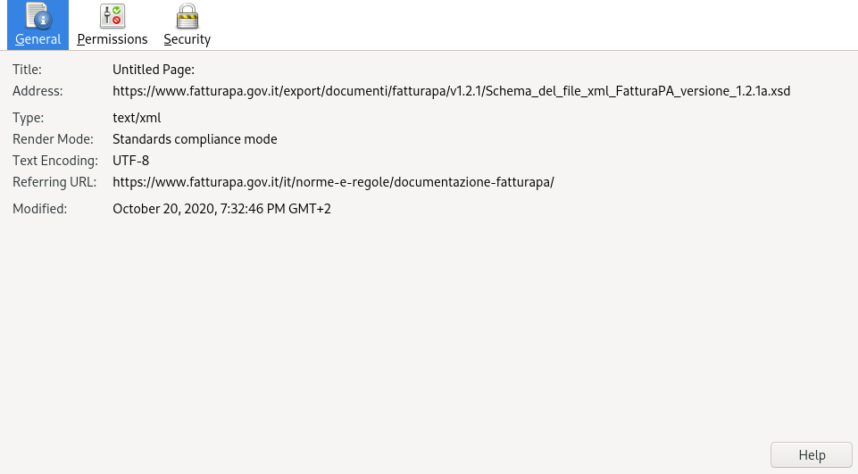

Considerations
==============

Purpose
-------

This software aims at:

- correctness

  - XML files are validated whenever possible

- integrity

  - a checksum is performed on the invoice file

- security

  - all cryptographical signature and certificates must be valid
  - invoice attachments are examined before saving them permanently

- privacy

  - works offline once you have downloaded the necessary files

Pipeline
--------

See the definition of pipeline:

- https://en.wikipedia.org/wiki/Pipeline_(software)

In this software, a pipeline is a sequence of steps that given the signed invoice file
and its metadata file makes it possible to obtain:

- various integrity and authenticity verifications
- the html output of the invoice file
- the extraction of embedded attachments

Description
```````````

Without entering in too much detail (you can read the source code for that),
we can divide the pipeline into three main steps:

===========     ===================================================
Step number     Actions
===========     ===================================================
1               compare metadata file content with the invoice file
2               check invoice signature and signer's certificate
3               generate outputs
===========     ===================================================

Software dependencies
---------------------

OpenSSL
```````

Support
~~~~~~~

Due to the lack of support for most of the PKCS#7 functionality in
PyOpenSSL, all OpenSSL operations are performed using the ``subprocess``
module which calls the ``openssl`` binary installed on the system.

See also:

- https://stackoverflow.com/questions/45104923/pyopenssls-pkcs7-object-provide-very-little-information-how-can-i-get-the-sha1/45111623#45111623
- https://stackoverflow.com/questions/45782506/is-there-any-python-package-for-parsing-pkcs7?rq=1

Bug
~~~

There are problems with recent versions of OpenSSL concerning PKCS#7 file decoding:

- https://github.com/eniocarboni/p7m/issues/4
- https://github.com/eniocarboni/p7m/issues/7
- https://www.mail-archive.com/openssl-users@openssl.org/msg85901.html

A possible solution it use an older system. If you really trust the file you can
disable signature checking with the appropriate option. I strongly discourage
the latter solution since if you cannot prove its authenticity the invoice has no legal
value.

lxml vs defusedxml
``````````````````

I decided to use lxml because it supports XML stylesheets (XSLT) as
defusedxml does not.

At first, using defusedxml seemed the best bet because of
the increased security:

- https://github.com/tiran/defusedxml#python-xml-libraries

There is the possibility to use defusedxml anyway by simply
editing the API file like this:


::


    import defusedxml.ElementTree as ET


instead of:


::


    import lxml.etree as ET


You must also add defusedxml and re-install the requirements as described
in the contributing section.


Official documentation
----------------------

========================================       =========================================================================                        =======================================================================
Type                                           Current                                                                                          Obsolete
========================================       =========================================================================                        =======================================================================
Nomativa                                       https://www.fatturapa.gov.it/it/norme-e-regole/normativa/                                        - https://www.fatturapa.gov.it/export/fatturazione/it/normativa/f-1.htm
Documentazione fatturaPA                       https://www.fatturapa.gov.it/it/norme-e-regole/documentazione-fatturapa/                         - https://www.fatturapa.gov.it/export/fatturazione/it/normativa/f-2.htm
Documentazione Sistema d'Interscambio          https://www.fatturapa.gov.it/it/norme-e-regole/DocumentazioneSDI/                                - https://www.fatturapa.gov.it/export/fatturazione/it/normativa/f-3.htm
========================================       =========================================================================                        =======================================================================

XML schemas for document validations
````````````````````````````````````

Most of XML schemas seem to be non-existing. Only the one for the
invoice file was found, and was reported by lxml as incorrect.

For sake of completeness the current supported versions
and the SHA-512 and SHA-256 checksums are reported in the following table:

=========================================  ================================================================================================================  ====================================================================================================================================  ====================================================================
Name                                       URL                                                                                                               SHA-512                                                                                                                                SHA-256
=========================================  ================================================================================================================  ====================================================================================================================================  ====================================================================
XML schema for FatturaPA version 1.2       https://www.fatturapa.gov.it/export/documenti/fatturapa/v1.2.1/Schema_del_file_xml_FatturaPA_versione_1.2.xsd     ``e1deab535099bfe9aef798c7d75a992f562c2ffa7648e446a8e1c6b894691feecba0cc9dceb02eba02243a951e1423adcac043a49bb8ab255a88b5b3ecf013d2``  ``fecdf8122fa86d80d4ab6901149a4e5390d9880c00de9987d180a2959d54c842``
XML schema for FatturaPA version 1.2.1     https://www.fatturapa.gov.it/export/documenti/fatturapa/v1.2.1/Schema_del_file_xml_FatturaPA_versione_1.2.1a.xsd  ``2a7c3f2913ee390c167e41ae5618c303b481f548f9b2a8d60dddc36804ddd3ebf7cb5003e5cc6996480c67d085b82b438aff7cc0f74d7c104225449785cb575b``  ``1a14ecdc867a01f447052ff1613688deef6f88bbee522f120be060f68d251976``
=========================================  ================================================================================================================  ====================================================================================================================================  ====================================================================

Updates
~~~~~~~

October 2020
............

The original URL of the schema file dissapeared.

.. image:: assets/old_link.png
   :alt: Old link

A new URL points to the schema:

- https://www.fatturapa.gov.it/export/documenti/fatturapa/v1.2.1/Schema_del_file_xml_FatturaPA_versione_1.2.1a.xsd

This resource has been ``Last-Modified: Tue, 20 Oct 2020 19:29:21 GMT`` according to the HTTP headers.



June 2019
.........

According to the server the schema was last modified on
``Tue, 25 Jun 2019 10:16:31 GMT``, so they fixed an offending ``xsd`` typo:

- https://www.fatturapa.gov.it/export/fatturazione/sdi/fatturapa/v1.2.1/Schema_del_file_xml_FatturaPA_versione_1.2.1.xsd

Considerations
~~~~~~~~~~~~~~

Not having access to all schema file is a problem since there is no way to tell if

- the metadata file,
- the trusted list file,
- the XML stylesheet file

are correct and conforming to specifications.

If you find these files please let me know and/or open a pull request.

Downloading of the W3C file
~~~~~~~~~~~~~~~~~~~~~~~~~~~

The W3C schema file is a dependency for the invoice schema file and it needs to be downloaded
separately. For some reason the downloading of this file takes a few seconds.

Fattura PA vs Fattura B2B
``````````````````````````

Digital signature
~~~~~~~~~~~~~~~~~

Some websites say that digital signature of the *Fattura PA* is compulsory and
in other cases it is not.

- https://www.agendadigitale.eu/documenti/fatturazione-elettronica/fattura-elettronica-e-firma-come-garantire-autenticita-dellorigine-e-integrita-del-contenuto/

If you find any official source please let me know and/or open a pull request.

Support for non-signed invoice files has been added because of at least one
reported case.

Closing note
------------

Although this whole system has its merits, it has been put into production
with lots of missing pieces (see notes above). Given the importance of it I think this
is unacceptable. I will not make any more comments because I may risk legal actions...
